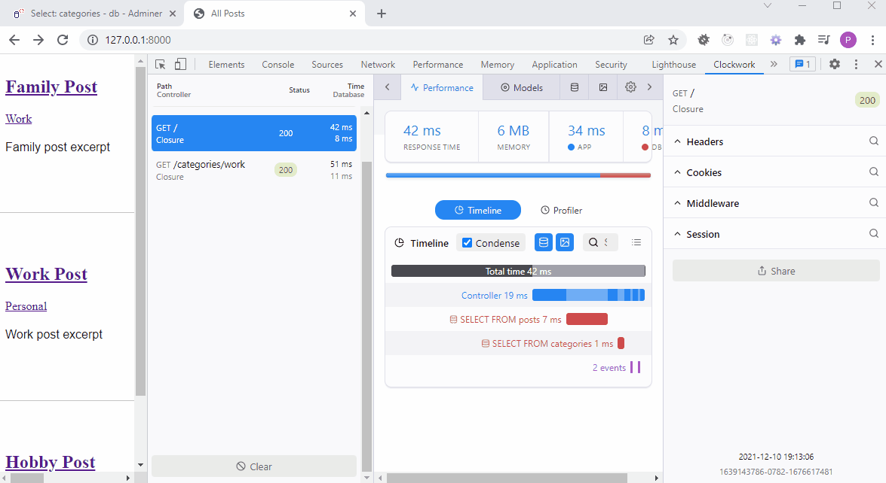
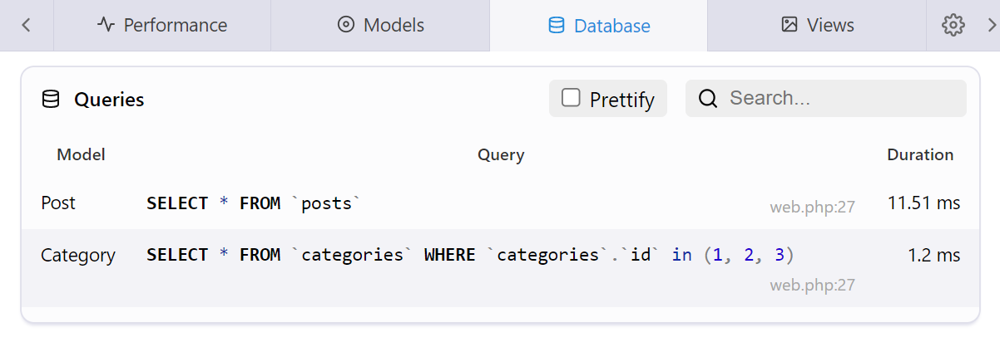
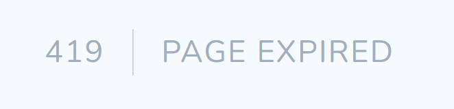
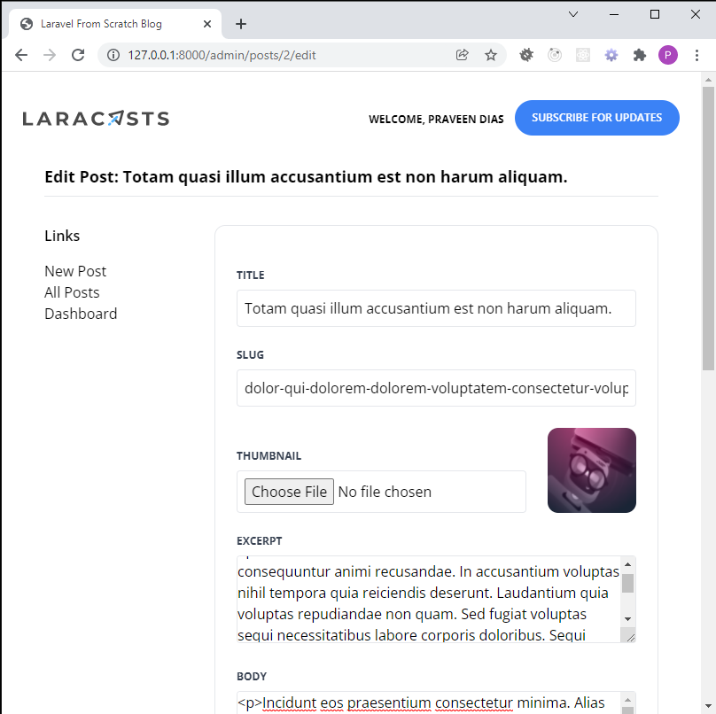

# MySQL DB
```
docker compose -f docker/docker-compose.yml up --build 
```

# Debugging PHP in the Browser

## Fixing the n+1 Problem

Meet [Clockwork](https://github.com/itsgoingd/clockwork)



## Solution

From
```
'posts' => Post::all()
```
To
```
'posts' => Post::with('category')->get()
```



## Laravel CSRF Protection

```
@csrf
```
Be sure to include the **Cross Site Request Forgery** Protection tags.



# Blog Administration

Complete administration of blog posts with all 8 RESTful actions implemented for the posts resource.

Custom `@admin` directives to hide dropdown menu items from unwanted users.

```
@admin
    <x-dropdown-item href="/admin/dashboard/" :active="request()->is('admin/dashboard')">Dashboard</x-dropdown-item>
    <x-dropdown-item href="/admin/posts/create/" :active="request()->is('admin/posts/create')">New Post</x-dropdown-item>
@endadmin

```

